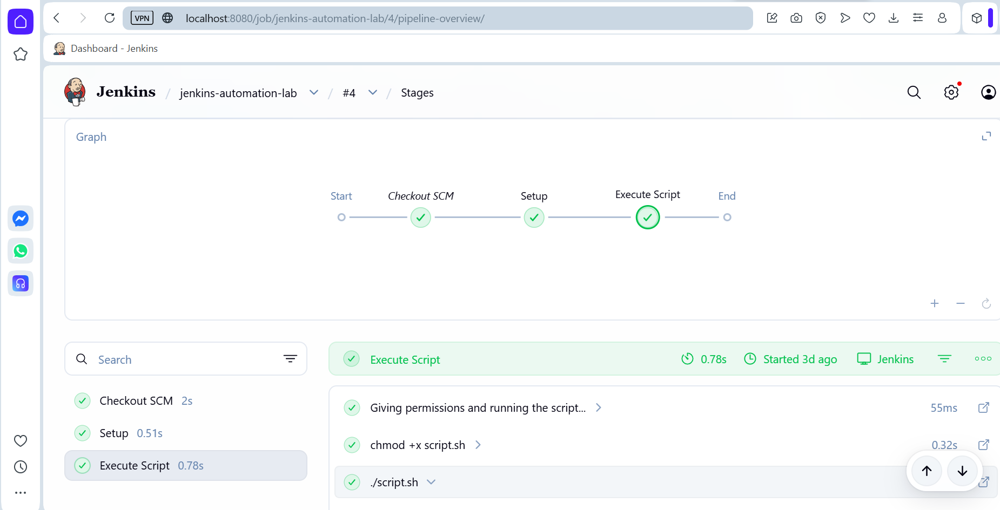
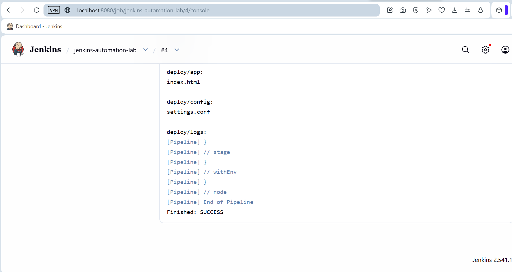

# Jenkins Automation Lab

## Project Workflow & Proof of Concept

### 1. Docker Setup
Jenkins is running inside a Docker container, mapped to port 8080.

### 2. Automation Script (script.sh)
This script handles the creation of the deployment folder structure.

### 3. Pipeline Configuration (Jenkinsfile)
Defined as "Pipeline as Code," telling Jenkins how to execute the build.

### 4. GitHub Webhook via ngrok
Configuring the tunnel to allow GitHub to talk to our local Jenkins server.

### 5. Successful Webhook Trigger
Verification that Build was automatically started by a GitHub push.

### 6. Pipeline Stage View
Visual representation of the successful stages of the automation.

### 7. Final Verification
Console output showing the successful execution of the script.
